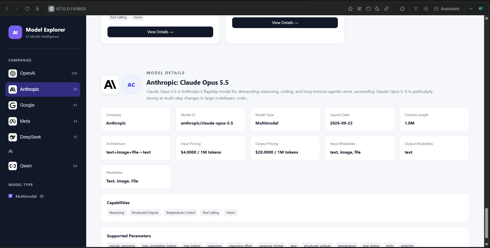

# AI Model Explorer

An interactive **AI Model Explorer** built with Flask, JavaScript,
OpenRouter, Docker, Jenkins and Kubernetes/Minikube.

The application provides a dynamic view of AI models grouped by
company/provider. Users can select a company, browse the model versions
available through OpenRouter, filter models by dynamically derived model
type, and inspect detailed model metadata such as launch date, context
length, architecture, pricing, modalities, capabilities and supported
parameters.

This project was implemented as **Case Study 1 --- CI/CD Implementation
using GitHub and Jenkins**, with Docker containerization, Trivy security
scanning and Kubernetes deployment through Minikube.

------------------------------------------------------------------------

## 1. Project Objectives

The project demonstrates an end-to-end software delivery workflow:

``` text
Developer
   |
   v
Git / GitHub
   |
   v
Flask Application
   |
   +--> OpenRouter Model API
   |
   v
Black + Flake8 + Pytest
   |
   v
Docker Build
   |
   v
Trivy Security Scan
   |
   v
Jenkins CI/CD
   |
   v
Local Docker Registry
   |
   v
Kubernetes / Minikube
   |
   v
AI Model Explorer
```

### Main application capabilities

-   Dynamic AI company/provider selection
-   Dynamic model version listing
-   Company-specific model type filtering
-   Model detail view
-   OpenRouter-powered live model catalog
-   Company logos and model icons/initials
-   Model launch date
-   Context length
-   Architecture
-   Input/output pricing
-   Input/output modalities
-   Capabilities
-   Supported parameters
-   Kubernetes health endpoint
-   Containerized deployment
-   Jenkins CI/CD pipeline
-   Trivy vulnerability gate

------------------------------------------------------------------------

# 2. Technology Stack

  Area                 Technology
  -------------------- -----------------------
  Backend              Python 3.10
  Web framework        Flask 3.1.3
  Frontend             HTML, CSS, JavaScript
  AI model catalog     OpenRouter API
  HTTP client          Requests
  Testing              Pytest
  Code formatting      Black
  Linting              Flake8
  Containerization     Docker
  Security scanning    Trivy 0.74.0
  CI/CD                Jenkins 2.568.3
  Container registry   Docker Registry 2
  Orchestration        Kubernetes
  Local Kubernetes     Minikube v1.39.0
  Kubernetes CLI       kubectl
  Java for Jenkins     Java 21
  Source control       Git / GitHub

------------------------------------------------------------------------

# 3. Project Structure

``` text
ai-model-explorer/
│
├── k8s/
│   ├── deployment.yaml
│   └── service.yaml
│
├── static/
│   ├── css/
│   │   └── style.css
│   └── js/
│       └── app.js
│
├── templates/
│   └── index.html
│
├── tests/
│   └── test_app.py
│
├── .dockerignore
├── .gitignore
├── .flake8
├── Dockerfile
├── Jenkinsfile
├── pytest.ini
├── README.md
├── requirements.txt
└── requirements-dev.txt
```

Generated Trivy reports and local environment files should not be
committed unless specifically required.

------------------------------------------------------------------------

# 4. Application Architecture

## Frontend

The frontend is implemented using:

-   HTML
-   CSS
-   JavaScript

The browser communicates with Flask API endpoints.

## Backend

The Flask backend:

1.  Requests the OpenRouter model catalog.
2.  Normalizes OpenRouter model metadata.
3.  Detects the provider/company.
4.  Derives the model type.
5.  Builds normalized capabilities and pricing information.
6.  Exposes the data through Flask API endpoints.
7.  Serves the frontend.

## External model source

OpenRouter is used as the live model catalog.

The application uses the OpenRouter API base URL:

``` text
https://openrouter.ai/api/v1
```

The OpenRouter API key is supplied through an environment variable and
is **not hard-coded in the application source code**.

------------------------------------------------------------------------

# 5. Flask API Endpoints

The application provides the following endpoints.

  -----------------------------------------------------------------------------
  Method              Endpoint                            Purpose
  ------------------- ----------------------------------- ---------------------
  GET                 `/`                                 Serves the AI Model
                                                          Explorer UI

  GET                 `/health`                           Application health
                                                          check

  GET                 `/api/companies`                    Returns supported
                                                          companies/providers

  GET                 `/api/companies/<company>/models`   Returns models for a
                                                          selected company

  GET                 `/api/models/<path:model_id>`       Returns detailed
                                                          information for a
                                                          selected model
  -----------------------------------------------------------------------------

The `/health` endpoint is also used by Kubernetes liveness and readiness
probes.

------------------------------------------------------------------------

# 6. OpenRouter Integration

The application dynamically retrieves model information from OpenRouter.

The following information can be normalized from the OpenRouter model
catalog:

-   Model ID
-   Model name
-   Company/provider
-   Model type
-   Context length
-   Architecture
-   Input modalities
-   Output modalities
-   Pricing
-   Launch date
-   Description
-   Capabilities
-   Supported parameters

### Provider groups currently configured

-   OpenAI
-   Anthropic
-   Google
-   Meta
-   DeepSeek
-   Mistral
-   Qwen

The model catalog is not maintained as a static list inside the
frontend.

------------------------------------------------------------------------

# 7. Model Type Filtering

The model type filter is derived from the models belonging to the
**currently selected company**.

This prevents irrelevant model types from appearing globally.

The implementation uses model metadata and naming/modalities to infer
categories such as:

-   LLM
-   SLM
-   Multimodal
-   Embedding

The type classification is an application-level inference because
OpenRouter does not provide a universal
`LLM / SLM / Multimodal / Embedding` field for every model.

------------------------------------------------------------------------

# 8. Prerequisites

The following prerequisites were installed/configured during the
implementation.

## 8.1 Operating System

Windows 11.

## 8.2 Python

Python:

``` text
Python 3.10.11
```

A project virtual environment is used:

``` powershell
python -m venv .venv
```

Activate it:

``` powershell
.\.venv\Scripts\Activate.ps1
```

For Git Bash:

``` bash
source .venv/Scripts/activate
```

------------------------------------------------------------------------

# 9. Python Dependencies

## Runtime dependencies

`requirements.txt` contains the runtime dependencies:

``` text
Flask
requests
```

Install:

``` powershell
python -m pip install -r requirements.txt
```

## Development dependencies

`requirements-dev.txt` contains:

``` text
-r requirements.txt
pytest
flake8
black
```

Install:

``` powershell
python -m pip install -r requirements-dev.txt
```

------------------------------------------------------------------------

# 10. OpenRouter Configuration

Set the API key as an environment variable.

PowerShell:

``` powershell
$env:OPENROUTER_API_KEY="YOUR_OPENROUTER_API_KEY"
$env:OPENROUTER_BASE_URL="https://openrouter.ai/api/v1"
```

Verify that the variable exists without printing the key:

``` powershell
if ($env:OPENROUTER_API_KEY) {
    Write-Host "OPENROUTER_API_KEY is set"
} else {
    Write-Host "OPENROUTER_API_KEY is NOT set"
}
```

### Security

Do not:

-   hard-code the API key in `app.py`
-   commit the API key to GitHub
-   place the API key in `deployment.yaml`
-   bake the API key into the Docker image
-   upload the key in screenshots

For Kubernetes, the key is stored as a Kubernetes Secret.

------------------------------------------------------------------------

# 11. Running Locally

From the project directory:

``` powershell
.\.venv\Scripts\Activate.ps1
```

Set the OpenRouter variables:

``` powershell
$env:OPENROUTER_API_KEY="YOUR_OPENROUTER_API_KEY"
$env:OPENROUTER_BASE_URL="https://openrouter.ai/api/v1"
```

Start Flask:

``` powershell
python app.py
```

The application runs on:

``` text
http://127.0.0.1:5000
```

Health check:

``` powershell
curl.exe http://127.0.0.1:5000/health
```

Companies:

``` powershell
curl.exe http://127.0.0.1:5000/api/companies
```

------------------------------------------------------------------------

# 12. Localhost Application Output

After starting the Flask application locally, open:

``` text
http://127.0.0.1:5000
```

or:

``` text
http://localhost:5000
```

The browser should display the **AI Model Explorer** UI.

<p align="center">
  
</p>

### What to verify in the localhost application

The local application should demonstrate:

1.  The **AI Model Explorer** home page loads successfully.
2.  The Companies panel is displayed on the left.
3.  Selecting a company loads its available models dynamically.
4.  The **Model Type** filter is derived from the selected company's
    available models.
5.  Selecting a model displays detailed metadata including:
    -   Model name and model ID
    -   Model type
    -   Launch date, when provided by OpenRouter
    -   Context length
    -   Architecture
    -   Input and output pricing
    -   Input and output modalities
    -   Capabilities
    -   Supported parameters
6.  The application status indicates that it is connected to OpenRouter
    when the API key and network connection are available.

### Localhost startup procedure

From the project root:

``` powershell
.\.venv\Scripts\Activate.ps1
```

Set the OpenRouter environment variables:

``` powershell
$env:OPENROUTER_API_KEY="YOUR_OPENROUTER_API_KEY"
$env:OPENROUTER_BASE_URL="https://openrouter.ai/api/v1"
```

Start Flask:

``` powershell
python app.py
```

Open the application:

``` text
http://127.0.0.1:5000
```

### Optional API checks

Health endpoint:

``` powershell
curl.exe http://127.0.0.1:5000/health
```

Companies endpoint:

``` powershell
curl.exe http://127.0.0.1:5000/api/companies
```

A successful local setup should return the application health response
and the dynamically discovered company/provider data.

### Important distinction

The localhost URL demonstrates the **local Flask application**. It is
separate from the Kubernetes/Minikube deployment.

For the Kubernetes deployment, use:

``` powershell
kubectl get deployment ai-model-explorer
kubectl get pods -l app=ai-model-explorer
kubectl get service ai-model-explorer
minikube service ai-model-explorer --url
```

The Minikube service command provides the URL used to access the
Kubernetes-hosted application.

# 13. Code Quality Checks

The project uses Black and Flake8.

## Flake8

``` powershell
python -m flake8 app.py tests
```

Configuration is stored in:

``` text
.flake8
```

Current configuration:

``` ini
[flake8]
max-line-length = 88
```

## Black

``` powershell
python -m black --check app.py tests
```

## Pytest

``` powershell
python -m pytest -v
```

### Final local validation

The final validation completed successfully:

``` text
Flake8: PASS
Black: PASS
Pytest: 7 passed
```

The seven tests cover:

-   Home page
-   Health endpoint
-   Companies endpoint
-   OpenAI model endpoint
-   Model details endpoint
-   Invalid company
-   Invalid model

------------------------------------------------------------------------

# 14. Git Repository and GitFlow

The project uses Git and GitHub.

Repository:

``` text
KarthikBalaje/ai-model-explorer
```

The project uses the following branch structure:

``` text
main
staging
feature/ai-model-explorer
```

The main development work was performed on:

``` text
feature/ai-model-explorer
```

The implementation history includes commits for:

-   Initial project
-   Docker containerization
-   Security hardening
-   Jenkins CI/CD
-   Minikube deployment
-   Dynamic OpenRouter model explorer

Useful commands:

``` bash
git branch -a
```

``` bash
git log --oneline --decorate --graph --all -15
```

Check working tree:

``` bash
git status
```

------------------------------------------------------------------------

# 15. Docker

The project uses a multi-stage Dockerfile.

The Docker build consists of:

### Stage 1 --- Builder

Runtime dependencies are installed into:

``` text
/install
```

### Stage 2 --- Runtime

The application uses:

``` text
python:3.10-slim
```

The runtime image contains:

-   `app.py`
-   `templates/`
-   `static/`
-   Python runtime dependencies

The Docker image exposes:

``` text
5000
```

and starts using:

``` dockerfile
CMD ["python", "app.py"]
```

------------------------------------------------------------------------

# 16. Docker Build

Build the image:

``` powershell
docker build -t ai-model-explorer:local .
```

Check the image:

``` powershell
docker images ai-model-explorer
```

The validated Jenkins image is:

``` text
localhost:5001/ai-model-explorer:8
```

The final image size was approximately:

``` text
128.1 MiB
```

which is below the case-study target of 150 MB.

------------------------------------------------------------------------

# 17. Local Docker Registry

A local Docker Registry was configured:

``` powershell
docker run -d `
  --name ai-model-registry `
  -p 5001:5000 `
  --restart unless-stopped `
  registry:2
```

Check the registry:

``` powershell
curl.exe http://127.0.0.1:5001/v2/_catalog
```

Check image tags:

``` powershell
curl.exe http://127.0.0.1:5001/v2/ai-model-explorer/tags/list
```

The validated registry contained:

``` json
{
  "name": "ai-model-explorer",
  "tags": ["8", "6"]
}
```

------------------------------------------------------------------------

# 18. Trivy Security Scanning

Trivy was used as a CI/CD security gate.

Version used:

``` text
Trivy 0.74.0
```

Scan command:

``` powershell
trivy image `
  --severity HIGH,CRITICAL `
  --ignore-unfixed `
  localhost:5001/ai-model-explorer:8
```

The validated Build #8 image reported:

``` text
Vulnerabilities: 0
```

The scan therefore passed the configured HIGH/CRITICAL vulnerability
gate.

The pipeline only pushes the Docker image after the Trivy gate succeeds.

------------------------------------------------------------------------

# 19. Jenkins CI/CD

Jenkins version:

``` text
2.568.3
```

Java:

``` text
Java 21
```

Jenkins job:

``` text
ai-model-explorer-pipeline
```

Branch:

``` text
feature/ai-model-explorer
```

Jenkinsfile stages:

``` text
Checkout
   |
Build
   |
Docker Build
   |
Post Actions
```

The Build stage performs:

``` text
Install development dependencies
        |
Black
        |
Flake8
        |
Pytest
```

The Docker Build stage performs:

``` text
Docker build
      |
Trivy scan
      |
Docker push
```

### Successful build

The validated pipeline completed successfully as:

``` text
Jenkins Build #8
```

and produced:

``` text
localhost:5001/ai-model-explorer:8
```

------------------------------------------------------------------------

# 20. Kubernetes / Minikube

Minikube:

``` text
v1.39.0
```

Kubectl:

``` text
v1.36.1
```

Kubernetes:

``` text
v1.37.0
```

Driver:

``` text
Docker
```

The application is deployed using:

``` text
k8s/deployment.yaml
k8s/service.yaml
```

------------------------------------------------------------------------

# 21. Kubernetes Deployment

Deployment:

``` text
ai-model-explorer
```

Replicas:

``` text
2
```

Strategy:

``` text
RollingUpdate
```

Configuration:

``` yaml
maxUnavailable: 0
maxSurge: 1
```

### Health probes

Liveness:

``` text
GET /health
```

Readiness:

``` text
GET /health
```

Both probes use container port:

``` text
5000
```

### Resources

The deployment defines CPU and memory requests/limits.

------------------------------------------------------------------------

# 22. Kubernetes Service

Service:

``` text
ai-model-explorer
```

Type:

``` text
NodePort
```

Service port:

``` text
80
```

Target port:

``` text
5000
```

Get the service:

``` powershell
kubectl get service ai-model-explorer
```

Get the Minikube URL:

``` powershell
minikube service ai-model-explorer --url
```

The application was successfully accessed through the generated Minikube
service URL.

------------------------------------------------------------------------

# 23. Kubernetes OpenRouter Secret

The OpenRouter API key is provided to Kubernetes using:

``` text
openrouter-secret
```

The Deployment references it using:

``` yaml
env:
  - name: OPENROUTER_API_KEY
    valueFrom:
      secretKeyRef:
        name: openrouter-secret
        key: OPENROUTER_API_KEY
```

The base URL is configured as:

``` yaml
- name: OPENROUTER_BASE_URL
  value: https://openrouter.ai/api/v1
```

Create/update the secret from PowerShell:

``` powershell
kubectl create secret generic openrouter-secret `
  --from-literal=OPENROUTER_API_KEY="$env:OPENROUTER_API_KEY" `
  --dry-run=client -o yaml | kubectl apply -f -
```

Verify without exposing the key:

``` powershell
kubectl get secret openrouter-secret
```

------------------------------------------------------------------------

# 24. Kubernetes Deployment Commands

Apply the deployment:

``` powershell
kubectl apply -f k8s/deployment.yaml
```

Apply the service:

``` powershell
kubectl apply -f k8s/service.yaml
```

Check deployment:

``` powershell
kubectl get deployment ai-model-explorer
```

Check pods:

``` powershell
kubectl get pods -l app=ai-model-explorer
```

Check rollout:

``` powershell
kubectl rollout status deployment/ai-model-explorer
```

Check service:

``` powershell
kubectl get service ai-model-explorer
```

Check deployed image:

``` powershell
kubectl get deployment ai-model-explorer `
  -o jsonpath="{.spec.template.spec.containers[0].image}"
```

The validated deployment uses:

``` text
host.minikube.internal:5001/ai-model-explorer:8
```

------------------------------------------------------------------------

# 25. Minikube Registry Configuration

Because the Docker Registry is running on the Windows host, Minikube was
configured to allow the local registry:

``` text
host.minikube.internal:5001
```

Minikube was recreated/configured with the local registry treated as an
insecure registry:

``` powershell
minikube start `
  --driver=docker `
  --insecure-registry="host.minikube.internal:5001"
```

This allows Kubernetes pods inside Minikube to pull the locally
published application image.

------------------------------------------------------------------------

# 26. Final Validation Evidence

The project was validated through the following stages.

### Git

``` text
main
staging
feature/ai-model-explorer
```

### Code quality

``` text
Flake8: PASS
Black: PASS
Pytest: 7 passed
```

### Docker

``` text
Multi-stage build: PASS
Image size: ~128.1 MiB
```

### Trivy

``` text
HIGH/CRITICAL vulnerabilities: 0
```

### Jenkins

``` text
Build #8: SUCCESS
```

### Registry

``` text
ai-model-explorer:8
```

### Kubernetes

``` text
Deployment: 2/2
Pods: 2 Running
Service: NodePort
```

### Application

``` text
AI Model Explorer accessible through Minikube
OpenRouter model data successfully displayed
```

------------------------------------------------------------------------

# 27. Troubleshooting Notes

## Flake8 line length

The project uses:

``` ini
[flake8]
max-line-length = 88
```

in `.flake8`.

Run:

``` powershell
python -m flake8 app.py tests
```

## Docker registry connection

The Kubernetes image uses:

``` text
host.minikube.internal:5001
```

rather than:

``` text
localhost:5001
```

because the Kubernetes container needs to reach the registry running on
the Windows host.

## OpenRouter Secret

If Kubernetes reports:

``` text
secret "openrouter-secret" not found
```

create the secret before deploying:

``` powershell
kubectl create secret generic openrouter-secret `
  --from-literal=OPENROUTER_API_KEY="$env:OPENROUTER_API_KEY" `
  --dry-run=client -o yaml | kubectl apply -f -
```

## Minikube Docker driver

When using the Docker driver on Windows, the terminal used by:

``` powershell
minikube service ai-model-explorer --url
```

may need to remain open while the service tunnel is active.

------------------------------------------------------------------------

# 28. Case Study 1 Evidence

The implementation has evidence covering:

1.  Flask application and APIs
2.  Git repository and GitFlow
3.  Dockerfile
4.  Docker image
5.  Trivy vulnerability scanning
6.  Jenkins CI/CD
7.  Kubernetes Deployment
8.  Kubernetes Service
9.  Minikube runtime
10. Application output

The evidence report contains screenshots for:

-   AI Model Explorer application output
-   Jenkins Build #8
-   Kubernetes/Minikube deployment
-   GitFlow branches and commit history
-   Dockerfile
-   Trivy zero-vulnerability scan

------------------------------------------------------------------------

# 29. Quick Start

For a fresh local setup:

``` powershell
git clone git@github.com:KarthikBalaje/ai-model-explorer.git
cd ai-model-explorer

python -m venv .venv
.\.venv\Scripts\Activate.ps1

python -m pip install -r requirements-dev.txt

$env:OPENROUTER_API_KEY="YOUR_OPENROUTER_API_KEY"
$env:OPENROUTER_BASE_URL="https://openrouter.ai/api/v1"

python -m flake8 app.py tests
python -m black --check app.py tests
python -m pytest -v

python app.py
```

Open:

``` text
http://127.0.0.1:5000
```

------------------------------------------------------------------------

# 30. Project Outcome

The final implementation demonstrates a complete
development-to-deployment workflow:

``` text
GitHub
  ↓
Flask + OpenRouter
  ↓
Black / Flake8 / Pytest
  ↓
Docker Multi-stage Build
  ↓
Trivy Security Gate
  ↓
Jenkins Build #8
  ↓
Local Docker Registry
  ↓
Kubernetes Deployment
  ↓
Minikube Service
  ↓
AI Model Explorer
```

The project therefore combines application development, API integration,
testing, containerization, security scanning, CI/CD and Kubernetes
deployment into one end-to-end implementation.
